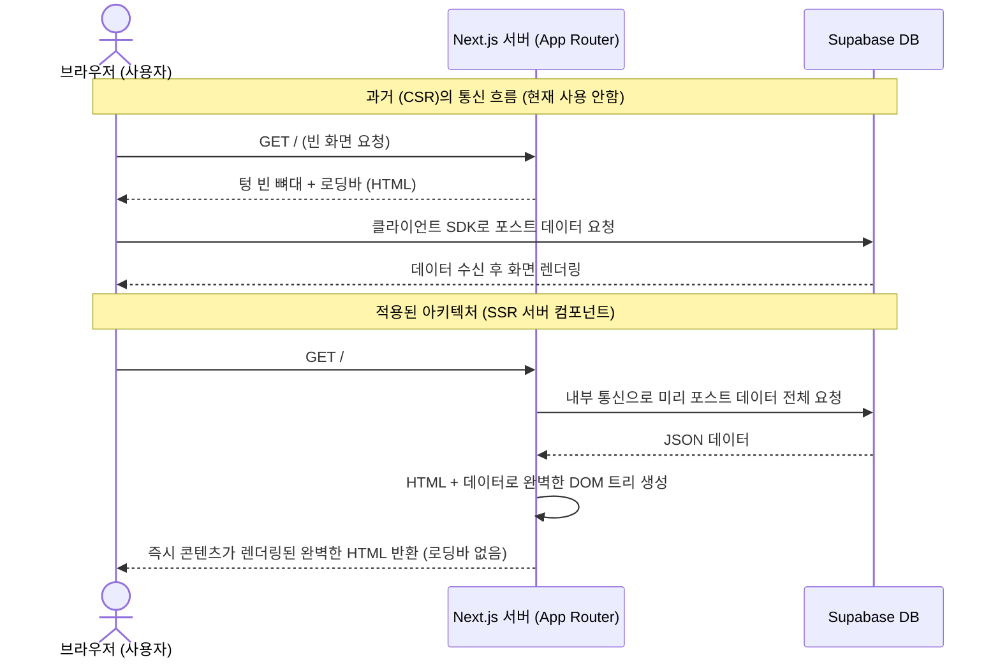
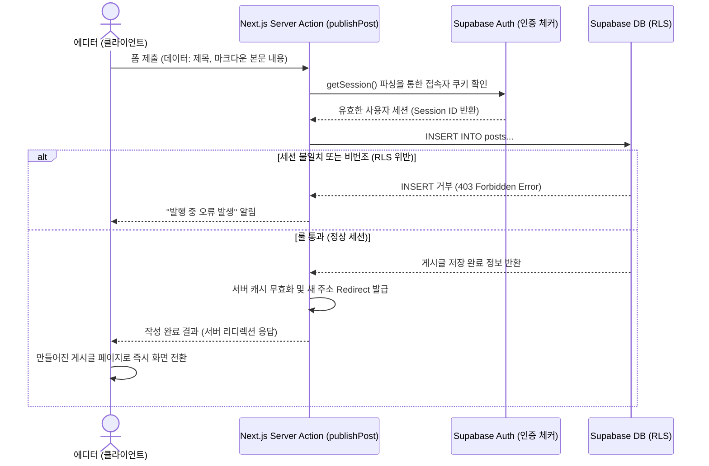

# DevBlog 시스템 아키텍처 및 학습 가이드 (NotebookLM 최적화)

이 문서는 DevBlog 프로젝트의 전체적인 시스템 아키텍처와 핵심 데이터 흐름을 다이어그램과 함께 제공합니다. **NotebookLM에 업로드하여 AI와 대화하며 프로젝트 구조를 심도 있게 학습하고 확장 아이디어를 논의하는 데 최적화**되어 있습니다.

## 1. 하이레벨 아키텍처 개요 (High-Level Architecture)

해당 프로젝트의 가장 큰 특징은 **Next.js 15 (App Router)**의 서버 사이드 렌더링(SSR/Server Components) 환경에서 데이터베이스 비즈니스 로직을 온전히 처리하며, **Supabase**의 백엔드 서비스(PostgreSQL, Auth)와 100% 결합된 현대적인 "서버리스 형태"를 가지고 있다는 점입니다.

```mermaid
graph TD
    %% 외부 환경
    User((사용자/브라우저))
    
    %% 프론트엔드 환경
    subgraph "Next.js 애플리케이션 (Frontend & BFF)"
        subgraph "Client Side"
            CC[클라이언트 컴포넌트\n(Client Components)\n- 마크다운 에디터 UI\n- 인터랙션 상태 관리]
        end
        
        subgraph "Server Side (Node.js)"
            SC[서버 컴포넌트\n(Server Components)\n- 초기 완전한 HTML 렌더링\n- SEO 최적화]
            SA[서버 액션\n(Server Actions)\n- POST/API 역할을 대체하는\n백엔드 비동기 함수]
            SupabaseServerSDK[Supabase Server SDK\n- 쿠키(Cookie) 기반 통신 코어]
        end
    end
    
    %% 백엔드 환경 (BaaS)
    subgraph "Supabase Cloud (Backend-as-a-Service)"
        Auth[Supabase Auth\n- 세션 기반 로그인/검증]
        Postgres[(PostgreSQL DB)]
        RLS{Row Level Security (RLS)\n- 테이블 데이터 방화벽 정책}
    end

    %% 연결 플로우
    User -- "화면 이동 / 페이지 접속" --> SC
    SC -- "완성된 HTML 제공" --> User
    
    User -- "UI 상호작용 (텍스트 입력 등)" --> CC
    CC -- "화면 재렌더링" --> User
    
    User -- "글쓰기/로그인 폼 제출" --> SA
    
    SC -- "READ 쿼리" --> SupabaseServerSDK
    SA -- "INSERT/UPDATE/DELETE\n인증 요청" --> SupabaseServerSDK
    
    SupabaseServerSDK -- "로그인/토큰 검증" --> Auth
    SupabaseServerSDK -- "SQL 요청" --> RLS
    
    Auth -- "검증된 세션" --> SupabaseServerSDK
    RLS -- "인가 성공 시 데이터 쓰기/읽기" --> Postgres
    Postgres -- "보안 데이터" --> SupabaseServerSDK
```

## 2. 주요 구성요소 상세

### 2.1 Next.js 서버 컴포넌트 (SSR) 패턴
- **대표 위치**: [app/page.tsx](file:///d:/blog/app/page.tsx), [app/posts/[slug]/page.tsx](file:///d:/blog/app/posts/%5Bslug%5D/page.tsx), [components/layout/Navbar.tsx](file:///d:/blog/components/layout/Navbar.tsx) 등
- **역할**: 클라이언트 브라우저에서 무거운 Javascript를 돌려 데이터를 가져오지 않고, Node.js 서버 단에서 `supabase` 객체를 통해 안전하게 데이터를 한 번에 가져와 결합합니다.
- **아키텍처 상 이점**: 클라이언트 자원 낭비 최소화, 검색 엔진(SEO)에 유리한 콘텐츠 제공, 데이터베이스 연결 키 유출 원천 차단.

### 2.2 Next.js 서버 액션 (Server Actions) 패턴
- **대표 위치**: [app/login/actions.ts](file:///d:/blog/app/login/actions.ts), [app/write/actions.ts](file:///d:/blog/app/write/actions.ts)
- **역할**: 기존의 독립된 백엔드 API 서버를 구성할 필요 없이 프론트엔드 코드 베이스 내에서 곧바로 비즈니스 로직(데이터 IN/OUT, 로그인 등) 함수를 만들어 호출하게 합니다.
- **아키텍처 상 이점**: 상태 관리(Redux 등)와 API 설계 비용의 혁신적인 단축. 클라이언트 컴포넌트(에디터)와 서버의 연결고리를 단일 함수 호출로 해결.

### 2.3 Supabase Row Level Security (RLS) 데이터 보안
- **역할 및 특징**: 인증 시스템(Auth)과 관계형 데이터베이스(Postgres)가 긴밀히 연결되어 설계된 방화벽입니다. 프론트엔드나 `next.js` 서버에서 보안 로직(ex: *"이 사용자가 로그인한 사람인지 검사"*)에 허점이 생겨도, 최종 도착지인 데이터베이스 테이블 단위의 Rule에서 한 번 더 인증 상태를 까다롭게 필터링합니다.

---

## 3. 핵심 데이터 흐름 (Data Flow Sequence)

### 시나리오 A: 사용자가 블로그 초기 화면을 열람할 때 (CSR vs SSR의 차이점)


### 시나리오 B: 인증된 사용자의 글쓰기 요청 (Server Actions)


---

## 4. NotebookLM 학습 최적화 추천 프롬프트 세트

이 문서를 바탕으로 NotebookLM 혹은 AI 챗봇에게 아래 질문들을 복사하여 던져보세요. 이 시스템 아키텍처를 기반으로 확장하는 데 큰 영감을 줍니다!

1. 이 아키텍처 다이어그램에서 설명된 "서버 컴포넌트(SSR)" 방식을 내가 예전에 많이 썼던 "클라이언트 사이드 (React `useEffect`) 방식"이랑 비교 분석해서 차이점과 장단점을 3줄로 알기 쉽게 요약해 줘.
2. 현재 [app/write/actions.ts](file:///d:/blog/app/write/actions.ts)라는 Server Action을 통해 DB 데이터를 넣고 있잖아. 만약 Server Action을 안 쓰고 [app/write/page.tsx](file:///d:/blog/app/write/page.tsx) 뷰 단에서 내가 강제로 DB에 밀어 넣으려고 코드를 짜면, Supabase RLS는 어떤 원리로 그 공격을 막아내는 건지 다이어그램에 기반해서 설명해 줘.
3. 이 아키텍처(Next.js App Router + Supabase RLS) 위에서 추후 "**방명록(Guestbook) 등록 기능**" 혹은 "**사용자별 댓글 달기**" 방식을 추가 구현하려고 해. 프론트, 폴더 구조, Server Action, DB 권한 설정 네 가지 측면에서 어떻게 초기 설계를 구축해야 하는 지 구조도를 그려줘.
4. Server Component와 Client Component 구조가 명확히 분리된 상태인데, 도대체 현존하는 클라이언트(ex. 마크다운 에디터) 요소에는 언제 어떻게 Server Component로 데이터를 안전하게 넘겨줘야 할까? Props 기반으로 예시 코드를 짜 줘.
